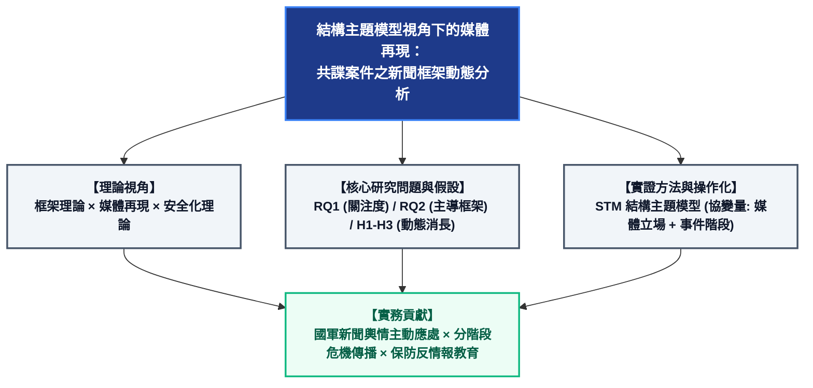
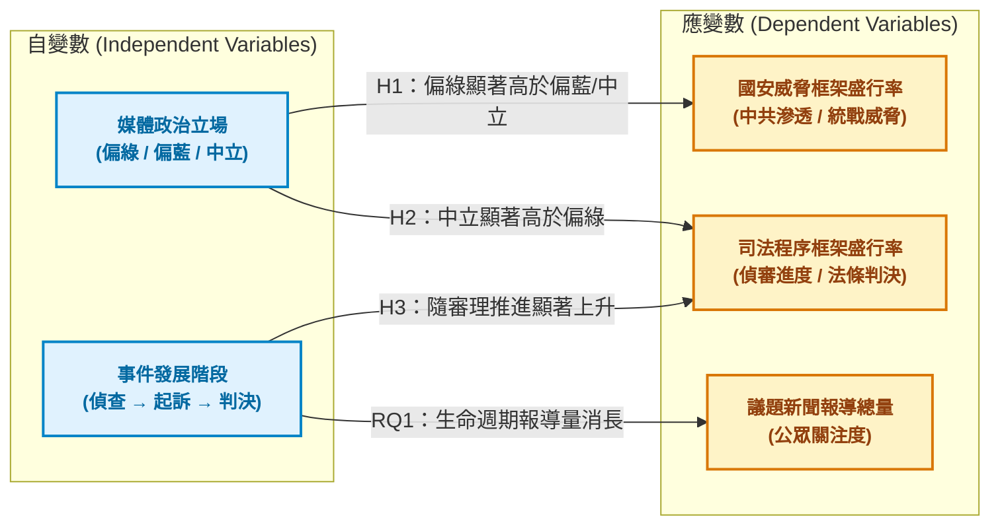
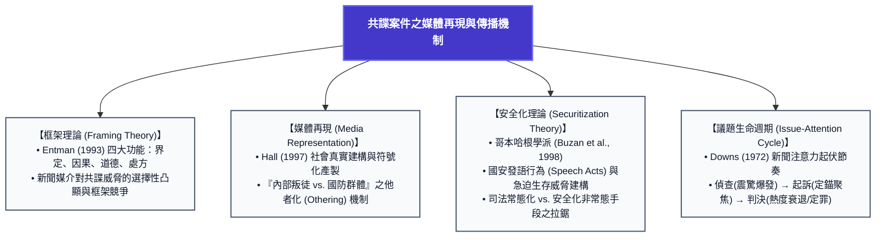
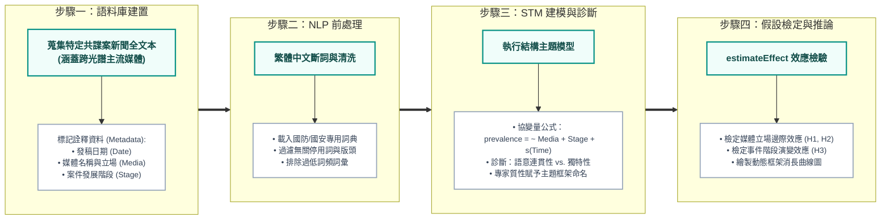

# 論文概念架構與多維度關鍵字矩陣 (v1.0)

**工作題目：** 結構主題模型視角下的媒體再現：共諜案件之新聞框架動態分析  
**文件定位：** 核心研究問題 (RQs) 與假設 (Hs) 之概念展開、變數操作化與文獻檢索指引  
**更新日期：** 2026-09-17  

---

## 一、 研究概念心智圖 (Conceptual Framework & Mind Maps)

---

### 1.1 論文總體研究設計架構 (Macro Research Framework)



---

### 1.2 核心研究問題與假設推演邏輯鏈 (RQs & Hypotheses Flow)

以簡潔直觀的「自變數 (IV) $\rightarrow$ 應變數 (DV)」路徑呈現研究問題與假設的檢驗關係：



> **RQ2（主導新聞框架）：** 透過 STM 結構主題模型從全文本語料中萃取潛在主題，歸納並命名出如上列 DV1（國安威脅）、DV2（司法程序）等核心代表性新聞框架。

#### 研究問題與假設檢驗對照表
| 編號 | 自變數 (IV) | 應變數 (DV) | 控制條件 | 預期實證方向 / 核心內涵 |
| :--- | :--- | :--- | :--- | :--- |
| **RQ1** | 事件發展階段 | 新聞報導總量 | 全媒體 | 檢驗新聞量隨「偵查 $\rightarrow$ 起訴 $\rightarrow$ 判決」之消長趨勢 |
| **RQ2** | 全文本語料庫 | 主題框架分布 | 文本特徵 | 萃取臺灣媒體建構之代表性新聞框架種類 |
| **H1** | 媒體政治立場 | 國安威脅框架盛行率 | 控制事件階段 | 偏綠媒體之盛行率顯著高於偏藍與中立媒體 |
| **H2** | 媒體政治立場 | 司法程序框架盛行率 | 控制事件階段 | 中立媒體之盛行率顯著高於偏綠媒體 |
| **H3** | 事件發展階段 | 司法程序框架盛行率 | 控制媒體立場 | 判決階段之框架盛行率顯著高於偵查階段 |


---

### 1.3 理論基礎與概念傳播機制 (Theoretical Integration)



---

### 1.4 結構主題模型 (STM) 實證流程與協變量配置



---

## 二、 多維度中英文關鍵字群 (Multidimensional Keyword Clusters)

為便於在國內外各大資料庫（Web of Science、Scopus、Google Scholar、臺灣博碩士論文加值系統、Airiti Library 華藝線上圖書館）進行系統性文獻回顧，將關鍵字依「理論、方法、研究客體、動態變數、實務應用」拆解為五大維度：

### 維度一：傳播與理論視角 (Theoretical Dimensions)
| 類別 | 中文關鍵字 | 英文關鍵字 (English Keywords) |
| :--- | :--- | :--- |
| **框架理論** | 框架理論、新聞框架、二次框架、框架效果、框架競逐 | Framing theory, News framing, Frame building, Frame competition, Second-level agenda setting |
| **媒體再現** | 媒體再現、社會建構、意識形態、他者化、象徵符號 | Media representation, Social construction of reality, Ideology, Othering, Symbolic representation |
| **安全化理論** | 安全化理論、哥本哈根學派、安全化發語行為、威脅建構 | Securitization theory, Copenhagen School, Securitizing speech acts, Threat construction, De-securitization |
| **議題動態** | 議題生命週期、議題設定、新聞週期、媒體關注度 | Issue-attention cycle, Agenda setting, News cycle, Media attention, Salience dynamics |

---

### 維度二：計算方法與文本探勘 (Methodological Dimensions)
| 類別 | 中文關鍵字 | 英文關鍵字 (English Keywords) |
| :--- | :--- | :--- |
| **主題模型** | 結構主題模型、主題模型、潛在狄利克雷分配、機率模型 | Structural Topic Model (STM), Topic modeling, Latent Dirichlet Allocation (LDA), Probabilistic topic models |
| **協變量與效應** | 協變量效應、主題盛行率、主題內容分布、語意連貫性 | Covariate analysis, Topic prevalence, Topic content, Semantic coherence, Exclusivity |
| **計算傳播學** | 計算傳播學、文本探勘、自然語言處理、繁體中文斷詞 | Computational communication, Text mining, Natural Language Processing (NLP), Chinese word segmentation |

---

### 維度三：研究客體與領域情境 (Core Domain & Empirical Object)
| 類別 | 中文關鍵字 | 英文關鍵字 (English Keywords) |
| :--- | :--- | :--- |
| **間諜與國安** | 共諜案、中共滲透、國家安全、反情報、保密防諜、軍事洩密 | Espionage, Chinese espionage, Chinese infiltration, National security, Counter-espionage, Counterintelligence, Military leak |
| **法律與規範** | 國家安全法、反滲透法、國家機密保護法、刑法外患罪 | National Security Act, Anti-Infiltration Act, Classified National Security Information Protection Act, Treason / Espionage offenses |
| **政治與地緣** | 兩岸關係、統戰、混合戰、認知作戰、灰色地帶威脅 | Cross-strait relations, United front, Hybrid warfare, Cognitive warfare, Gray-zone threat |

---

### 維度四：自變數、分期與動態特徵 (Variables & Longitudinal Dynamics)
| 類別 | 中文關鍵字 | 英文關鍵字 (English Keywords) |
| :--- | :--- | :--- |
| **媒體立場** | 媒體政治偏向、政治立場、黨派偏見、媒體偏見 | Media bias, Political slant, Ideological orientation, Media partisanship |
| **司法分期** | 偵查階段、羈押審理、起訴、審判、一審判決、三審定讞 | Investigation stage, Pretrial detention, Indictment, Judicial trial, Court verdict, Final judgment |
| **時間維度** | 時間序列分析、動態分析、縱貫面分析、演變趨勢 | Time series analysis, Dynamic framing, Longitudinal analysis, Temporal evolution |

---

### 維度五：國軍傳播與實務對策 (Military & Practical Dimensions)
| 類別 | 中文關鍵字 | 英文關鍵字 (English Keywords) |
| :--- | :--- | :--- |
| **軍事傳播** | 國防新聞、軍事傳播、政治作戰、軍事公共事務 | Defense journalism, Military communication, Political warfare, Military public affairs |
| **危機應變** | 戰略溝通、危機傳播、公眾信任、國防形象維護 | Strategic communication, Crisis communication, Public trust, Defense institutional image |

---

## 三、 資料庫檢索式推薦 (Boolean Search Strings)

### 1. 國際英文資料庫 (Web of Science / Scopus)
- **檢索主題：STM 方法應用於新聞框架與安全議題**
  ```text
  TS = (("Structural Topic Model" OR "structural topic modeling" OR "STM") 
        AND ("framing" OR "news frame" OR "media representation") 
        AND ("national security" OR "threat" OR "espionage" OR "intelligence" OR "trial"))
  ```
- **檢索主題：安全化與媒體報導之動態分析**
  ```text
  TS = (("securitization" OR "threat construction") 
        AND ("media" OR "journalism" OR "news") 
        AND ("China" OR "Taiwan" OR "cross-strait"))
  ```

### 2. 臺灣學術資料庫 (Airiti Library 華藝 / 臺灣博碩士論文知識加值系統)
- **檢索主題：結構主題模型之新聞與傳播應用**
  ```text
  ("結構主題模型" OR "STM" OR "主題模型") AND ("新聞" OR "框架" OR "媒體再現")
  ```
- **檢索主題：共諜與國安法制之媒體再現或輿論分析**
  ```text
  ("共諜" OR "國安法" OR "反滲透法" OR "滲透") AND ("新聞" OR "框架" OR "報導" OR "媒體再現")
  ```
- **檢索主題：國軍形象、保防與軍事新聞傳播**
  ```text
  ("國防" OR "國軍" OR "軍事新聞") AND ("媒體再現" OR "形象" OR "危機傳播" OR "框架")
  ```

---

## 四、 核心研究問題與假設之操作化與診斷建議

為確保在 **11 月中旬計畫書口試** 能通過嚴格檢驗，針對現有 RQs 與 Hs 提出以下操作化微調建議：

### 1. 避免在假設中過早固化主題編號（如 T2、T4）
- **現象：** `PROJECT.md` 中寫道「偏綠立場媒體使用強調『中共滲透』等相關框架（對應 T2）」、「司法程序等相關框架（對應 T4）」。
- **建議：** STM 屬於非監督/半監督模型，主題編號（$K=1, 2, \dots$）是在模型訓練後隨機生成的。在第一階段假設提出時，應以**「概念框架名稱」**（例如「國安威脅框架」、「司法程序框架」）撰寫；待 Chapter 3 & 4 跑出主題並進行質性驗證標籤化後，再對應到特定主題編號，避免口試委員質疑「未跑模型先預設編號」。

### 2. 明確界定自變數（媒體政治立場）的分類指標
- **現象：** H1 比較「偏綠 vs. 偏藍/中立」，H2 比較「中立 vs. 偏綠」。
- **建議：** 
  1. 口試委員必定會詢問「偏綠、偏藍、中立」是以何種客觀標準界定（例如：引用傳播學界現有量表、報紙社論立場文獻、或是公視/中央社作為基準組）。
  2. 補足 H2 中「偏藍媒體」的假設位置：偏藍媒體在共諜案司法程序中是更偏向法律條文，還是聚焦於政治追殺/司法中立性質疑？

### 3. 事件生命週期之切點操作化 (RQ1 & H3)
- **建議：** 必須在研究設計中訂出「偵查、起訴、判決」三大階段的時間戳記（Timestamp）錨定規則（如：偵辦約談/羈押日、檢方起訴記者會日、法院宣判日）。這三個時間點將成為 STM 協變量中分段時間變數的核心。

---

## 五、 建議下一步行動 (Next Actions)

1. **文獻庫建立：** 利用上述檢索式，在 `01_papers/` 蒐集 8-12 篇核心文獻（特別是使用 STM 分析新聞框架之 SSCI/TSSCI 論文）。
2. **選案界定：** 具體選定 1-2 起指標性共諜案件（如退役將領案、現役軍士官滲透案），定義蒐集的時間跨度。
3. **自訂字典建置：** 著手規畫國防與共諜專有名詞清單，為後續 STM 斷詞前處理做準備。

